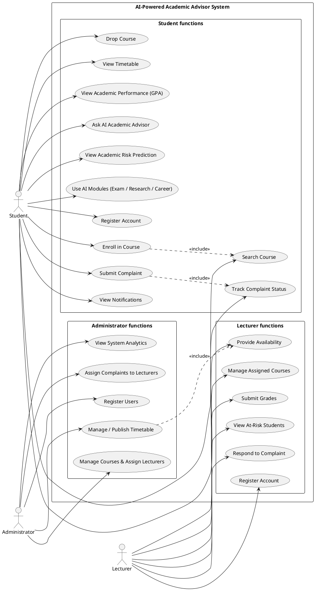
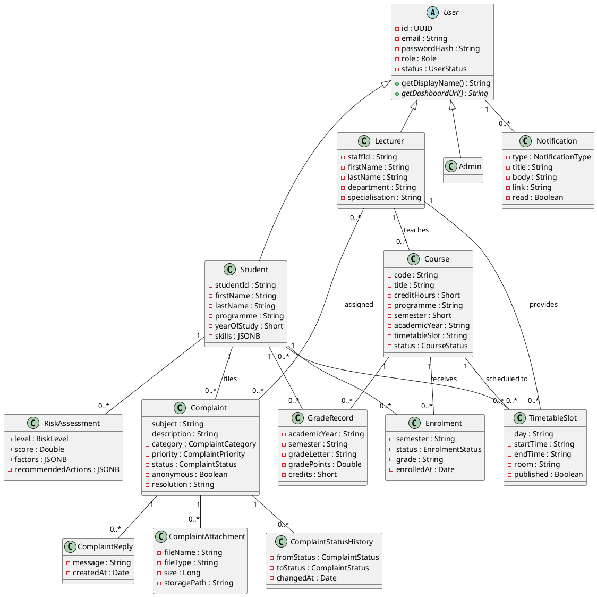
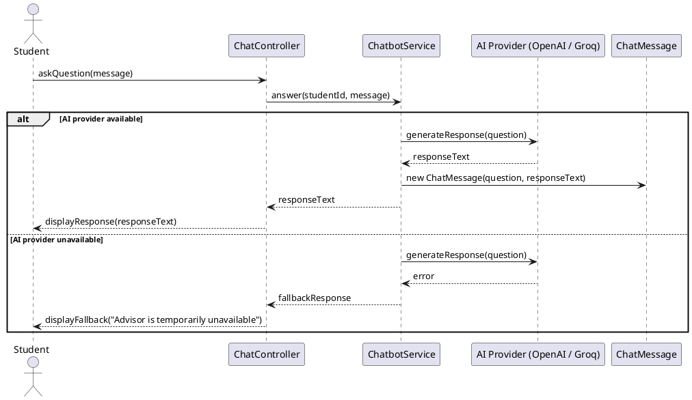
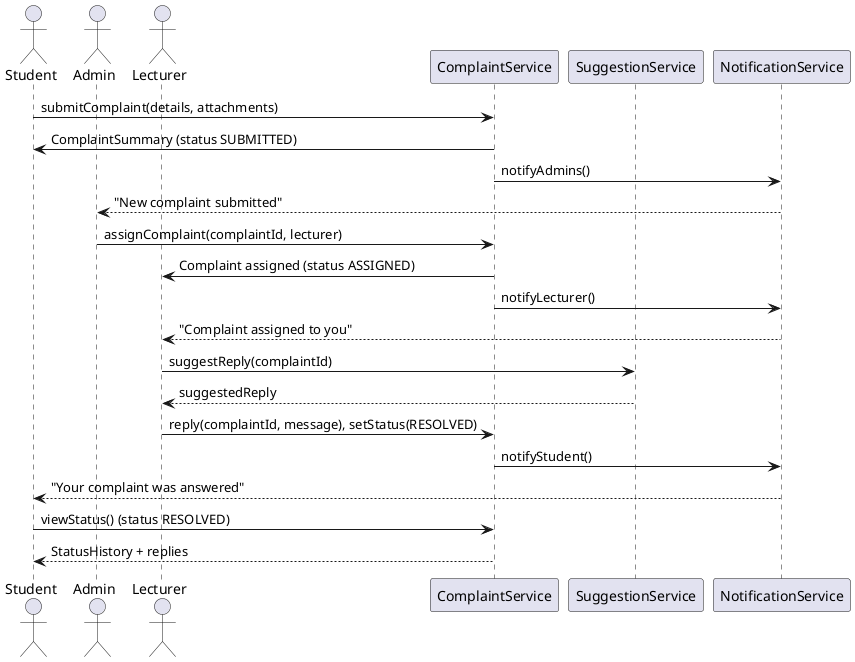
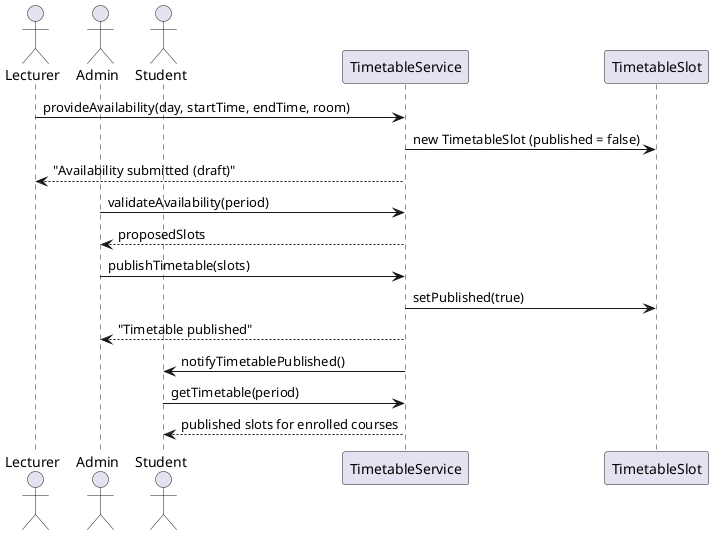
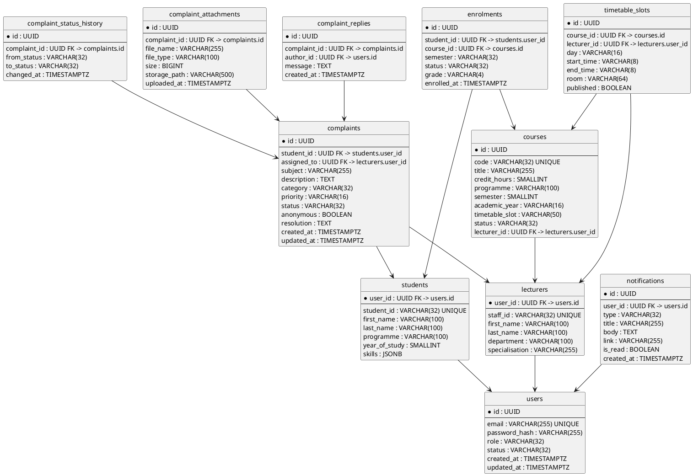
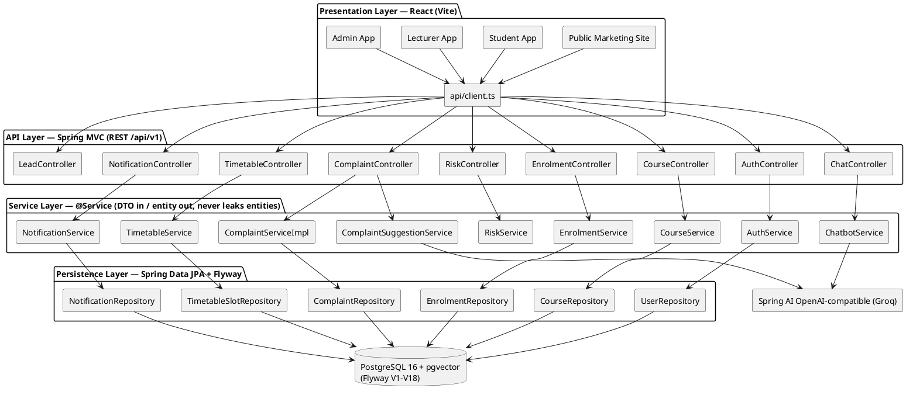

# Practical Continuous Assessment

## Case Study: AI-Powered University Academic Advisor System

A university seeks to move beyond a traditional Student Information System, which only stores academic records, toward an AI-Powered Academic Advisor capable of guiding students on course selection, graduation requirements, academic performance, career direction, and campus issues. Currently, advising is handled manually by staff, which does not scale to thousands of students and offers no predictive or personalised insight.

The university has adopted a Model Driven Architecture (MDA) approach, where the system is first designed using UML models before implementation. This document analyses, models, and partially implements the system using MDA principles, moving through the Computation Independent Model (CIM), Platform Independent Model (PIM), and Platform Specific Model (PSM) layers before final Java implementation.

The implemented system is **Compass**, built for Yaoundé International Business School (YIBS). It comprises:

- the core Student/Course/Enrolment domain and academic performance tracking;
- the AI Academic Advisor chatbot (RAG over the YIBS student handbook) plus the supporting AI modules (risk prediction, exam generator, research assistant, career recommendation);
- a **student complaint portal** with assignments, status tracking, attachments, in-app notifications, and AI-suggested replies;
- a **timetable module** where lecturers provide their availability, administrators validate and publish timetable slots, and students receive their weekly timetable;
- a public marketing website that captures prospective-student leads.

To keep the models traceable end to end, the core Student/Course/Enrolment domain, the AI advisor chatbot, the complaint portal, and the timetable flow are carried through every layer as the primary worked examples; the remaining AI modules extend the same pattern and are noted where relevant.

---

# Task 1: Computation Independent Model (CIM)

The CIM describes the business view of the AI-Powered Academic Advisor System, independent of any technical or computational detail. It captures what the system must do from the perspective of students, lecturers, and university administration.

## 1. System Requirements

1. The system shall maintain digital records of students, lecturers, administrators, and courses, replacing manual advising records.
2. The system shall track course enrolments and automatically compute academic performance (GPA/CGPA).
3. The system shall allow authorised staff to manage course and lecturer information.
4. The system shall provide an AI-powered advisory service that answers student questions about courses, graduation requirements, and academic topics using the official university documents.
5. The system shall provide predictive insight into a student's likelihood of academic success or risk.
6. The system shall provide AI modules for exam generation, research assistance, and career recommendation.
7. The system shall provide a digital complaint portal where students raise, track, and resolve campus complaints — optionally anonymously — and where administrators assign and lecturers resolve them with AI-suggested replies.
8. The system shall notify users of important events (complaint submitted, assigned, replied, status changed) through an in-app notification centre.
9. The system shall manage the weekly timetable: lecturers provide their availability, administrators validate and publish slots, and students receive their timetable.
10. The system shall expose a public marketing website that captures prospective-student leads.

## 2. Functional Requirements

**Student**

- The system shall allow a student to register an account (self-service sign-up).
- The system shall allow a student to search for a course by title or code.
- The system shall allow a student to enrol in an available course and to drop a course.
- The system shall allow a student to view their GPA and academic performance trend.
- The system shall allow a student to ask the AI Academic Advisor a question and receive a generated response with cited sources.
- The system shall allow a student to view an AI-generated academic risk prediction.
- The system shall allow a student to generate practice exam questions and to use the research assistant and career advisor.
- The system shall allow a student to submit a complaint (category, priority, description, optional attachments), including anonymously.
- The system shall allow a student to track the status of their own complaints and view replies.
- The system shall allow a student to view their in-app notifications and weekly timetable.

**Lecturer**

- The system shall allow a lecturer to register an account.
- The system shall allow a lecturer to manage the courses assigned to them.
- The system shall allow a lecturer to submit grades and to view at-risk students in their classes.
- The system shall allow a lecturer to view the complaints assigned to them, reply, and change their status.
- The system shall allow a lecturer to request an AI-suggested reply for a complaint.
- The system shall allow a lecturer to provide their weekly availability for timetable generation.

**Administrator**

- The system shall allow an administrator to register students, lecturers, and administrators.
- The system shall allow an administrator to manage courses and assign lecturers to courses.
- The system shall allow an administrator to view all complaints, assign them to lecturers, and monitor resolution.
- The system shall allow an administrator to validate lecturer availability and publish the weekly timetable.
- The system shall allow an administrator to view system analytics (enrolments, grades, complaints, AI usage).

## 3. Actor Identification

Three actors interact with the system:

- **Student** — searches for and enrols in courses, views academic performance, consults the AI Academic Advisor and the AI modules, files and tracks complaints, and receives notifications and a weekly timetable.
- **Lecturer** — manages assigned courses, submits grades, responds to assigned complaints (optionally assisted by the AI), and provides availability for the timetable.
- **Administrator** — registers users, oversees courses, assigns complaints, publishes the timetable, and provides system-level oversight separate from day-to-day academic activity.

## 4. Use Case Diagram

The diagram below shows the system's use cases grouped by actor. *Enroll in Course* includes *Search Course*, *Submit Complaint* includes *Track Complaint Status*, and *Manage/Publish Timetable* uses *Provide Availability*.

### PlantUML Script — Use Case Diagram



---

# Task 2: Platform Independent Model (PIM)

The PIM expresses the system's structure and behaviour using UML, independent of any programming language or platform.

## 1. Class Diagram

The design introduces a `User` superclass shared by `Student`, `Lecturer`, and `Admin`, since all three are people with an identity, email, and a role. `Course` records the code, title, credits, programme, and timetable slot. `Enrolment` links `Student` and `Course` and carries its own attributes (semester, status, grade). The complaint module is modelled by `Complaint` (with `ComplaintReply`, `ComplaintAttachment`, and `ComplaintStatusHistory`), the notification centre by `Notification`, and the timetable module by `TimetableSlot`, produced from lecturer availability and consumed by students.

### Classes and Attributes

- `User`: id, email, passwordHash, role, status
- `Student (extends User)`: studentId, firstName, lastName, programme, yearOfStudy, skills
- `Lecturer (extends User)`: staffId, firstName, lastName, department, specialisation
- `Admin (extends User)`: (no additional profile fields)
- `Course`: code, title, creditHours, programme, semester, academicYear, timetableSlot, status
- `Enrolment`: semester, status, grade, enrolledAt
- `GradeRecord`: academicYear, semester, gradeLetter, gradePoints, credits
- `RiskAssessment`: level, score, factors, recommendedActions, lastUpdated
- `Complaint`: subject, description, category, priority, status, anonymous, resolution
- `ComplaintReply`: message, createdAt
- `ComplaintAttachment`: fileName, fileType, size, storagePath
- `ComplaintStatusHistory`: fromStatus, toStatus, changedAt
- `Notification`: type, title, body, link, read
- `TimetableSlot`: day, startTime, endTime, room, published

### Relationships and Multiplicities

- `User` is a generalization of `Student`, `Lecturer`, and `Admin` (the role discriminates the subclass).
- `Student` 1 — 0..* `Enrolment`; `Course` 1 — 0..* `Enrolment`.
- `Lecturer` 1 — 0..* `Course` (a lecturer teaches many courses).
- `Student` 1 — 0..* `GradeRecord`; `Course` 1 — 0..* `GradeRecord`.
- `Student` 1 — 0..* `RiskAssessment`.
- `Student` 1 — 0..* `Complaint`; `Lecturer` 0..* — 0..* `Complaint` (assigned).
- `Complaint` 1 — 0..* `ComplaintReply` / `ComplaintAttachment` / `ComplaintStatusHistory`.
- `User` 1 — 0..* `Notification`.
- `Lecturer` 1 — 0..* `TimetableSlot` (provides availability); `Course` 1 — 0..* `TimetableSlot`; `Student` 0..* — 0..* `TimetableSlot` (receives published slots for enrolled courses).

### PlantUML Script — Class Diagram (PIM)



## 2. Sequence Diagram — Student Asks the AI Academic Advisor

The interaction between a Student, the `ChatController`, the `ChatbotService`, and the external AI provider. The service validates the question and delegates generation to the AI provider; if the provider is unreachable or returns an error, a fallback path is triggered and a friendly failure is reported back to the student.

### PlantUML Script — Sequence Diagram (Ask AI Advisor)



## 3. Sequence Diagram — Complaint Lifecycle (Student → Admin → Lecturer)

Traces the full complaint workflow: submission, assignment, AI-suggested reply, resolution, and notifications at each step.

### PlantUML Script — Sequence Diagram (Complaint Lifecycle)



## 4. Sequence Diagram — Timetable (Lecturer Availability → Admin Publication → Student Receives)

Traces the timetable flow: the lecturer proposes availability, the administrator validates and publishes the slots, and the student receives the published timetable.

### PlantUML Script — Sequence Diagram (Timetable)



---

# Task 3: OCL Constraints

The following business rules constrain the PIM model. Each is expressed formally in OCL and restated in plain language.

| # | Constraint | OCL | Plain-language rule |
|---|---|---|---|
| 1 | Course title required | `context Course inv: self.title <> ''` | A course cannot be registered without a title. |
| 2 | Enrolment date validity | `context Enrolment inv: self.enrolledAt <= Date::today()` | A student cannot be enrolled on a future date. |
| 3 | Seat availability | `context Enrolment inv: self.course.enrolledCount < self.course.capacity` | A student can only enrol in a course if a seat remains. |
| 4 | GPA range | `context Student inv: self.gpa >= 0.0 and self.gpa <= 4.0` | A student's GPA must stay within the 0.0–4.0 scale. |
| 5 | Complaint status transitions | `context Complaint inv: self.status = self.status.allowedTarget()` | A complaint may only move SUBMITTED → ASSIGNED → IN_PROGRESS → RESOLVED → CLOSED; a RESOLVED complaint cannot return to IN_PROGRESS. |
| 6 | Attachment limit | `context Complaint inv: self.attachments->size() <= 5` | A complaint can carry at most five attachments. |
| 7 | Timetable slot conflict | `context TimetableSlot inv: TimetableSlot.allInstances()->select(s \| s.day = self.day and s.startTime = self.startTime and s.room = self.room and s.published)->size() <= 1` | Two published lectures cannot occupy the same room at the same time on the same day. |
| 8 | Anonymous handling | `context Complaint inv: self.anonymous implies not self.student.isShown` | An anonymous complaint never reveals the student's identity on the UI or in notifications. |

These constraints are enforced in the Java implementation: 1 in course validation, 2 in the enrolment service, 3 in the enrolment service (throws a "course full" equivalent), 4 in GPA calculation, 5 in `ComplaintServiceImpl` (`InvalidStatusTransitionException`), 6 in complaint upload validation, 7 in `TimetableService.validateAvailability()`, and 8 in the complaint response mapping (anonymous masking).

---

# Task 4: Platform Specific Model (PSM)

The PSM binds the PIM to the concrete platform: PostgreSQL 16 with the pgvector extension, Java 17 / Spring Boot 3, JPA/Hibernate (with `ddl-auto: validate`), and Flyway-managed migrations V1–V18. The class diagram of Task 2 is realized as the physical relational model below.

## 1. Physical Data Model (PostgreSQL 16 + pgvector)

The `users` table and its `students` / `lecturers` / `admins` subtables implement the JOINED inheritance hierarchy of the PIM. Complaint, notification, and timetable tables carry their own identifiers so every entity is addressable through the REST API.

### PlantUML Script — ERD (PSM)



## 2. PIM-to-PSM Mapping

| PIM Class (Task 2) | PSM Table(s) | Notes |
|---|---|---|
| `User` | `users` | single table + discriminator column (`role`) |
| `Student` | `students` | JOINED subclass, FK to `users.id` |
| `Lecturer` | `lecturers` | JOINED subclass, FK to `users.id` |
| `Admin` | `admins` | JOINED subclass (no profile columns) |
| `Course` | `courses` | lecturer FK stores the assigned lecturer |
| `Enrolment` | `enrolments` | unique(student_id, course_id, semester) |
| `GradeRecord` | `grade_records` | one row per student per course per semester |
| `RiskAssessment` | `risk_assessments` | JSONB for factors/recommended actions |
| `Complaint` | `complaints` | `assigned_to` nullable until an admin assigns |
| `ComplaintReply` | `complaint_replies` | author FK → users |
| `ComplaintAttachment` | `complaint_attachments` | file stored on disk, path persisted |
| `ComplaintStatusHistory` | `complaint_status_history` | append-only audit trail |
| `Notification` | `notifications` | `is_read` flag |
| `TimetableSlot` | `timetable_slots` | `published` distinguishes draft vs published |
| AI chat (PIM note) | `ai_chat_messages` | student handbook RAG context |
| Public leads (PIM note) | `leads` | captured from the marketing site |

## 3. Deployment Platform

- **Frontend:** React 18 + TypeScript + Vite; axios client against `/api/v1`; two route groups (public marketing site under `PublicLayout`, authenticated app under `AppShell` + `ProtectedRoute`).
- **Backend:** Java 17, Spring Boot 3, Spring Web MVC, Spring Data JPA, Spring Security (JWT + BCrypt), MapStruct.
- **Database:** PostgreSQL 16 + pgvector; schema owned by Flyway migrations (V1–V18); `ddl-auto: validate` in all environments.
- **AI provider strategy:** Spring AI `OpenAiChatModel` pointing at a configurable OpenAI-compatible base URL (default `https://api.groq.com/openai`, model `llama-3.3-70b-versatile`) with a deterministic fallback when the provider is unreachable or no API key is configured.

---

# Task 5: PSM/JAVA — Summarised Real Implementation

The Java implementation is a layered Spring Boot application. The next diagram shows the request flow used by every worked example: a UI screen calls a REST endpoint, the controller delegates to a `@Service`, the service orchestrates repositories and AI providers, and entities are mapped to DTOs before leaving the service layer.

## 1. Layered Architecture

### PlantUML Script — Layered Architecture (PSM/Java)



## 2. Key Components

- **Security:** Spring Security filter chain; JWT issued on login/register; `PasswordEncoder` is BCrypt (cost 12); routes split into public (marketing site, `/api/v1/auth/**`, health) and protected (`/api/v1/**`), with role checks for lecturer/admin actions.
- **Complaint workflow:** `ComplaintServiceImpl` owns the state machine (`SUBMITTED → ASSIGNED → IN_PROGRESS → RESOLVED → CLOSED`), rejects invalid transitions with `InvalidStatusTransitionException`, persists `ComplaintStatusHistory`, and triggers `NotificationService` after every state change. `ComplaintSuggestionService` calls the AI provider and returns the generated reply, falling back to a generic template when the provider is unavailable.
- **AI advisor:** `ChatbotService` builds a RAG prompt from the student handbook (embedded with pgvector) and generates the answer with sources; `RiskService`, `ExamGenerationService`, `ResearchAssistantService`, and `CareerService` follow the same provider pattern for their modules.
- **Timetable:** `TimetableService` persists lecturer-proposed `TimetableSlot` rows as drafts (`published = false`), validates room/time conflicts when the administrator publishes (`published = true`), and serves students only published slots of courses they are enrolled in.
- **Notification centre:** `NotificationService.create(...)` persists a row and returns it via DTO; the frontend polls `GET /notifications` and marks them read.

## 3. Worked-Example Trace (Complaint Lifecycle)

The Task 2 sequence diagram is realised by exactly this call chain: `POST /api/v1/complaints` (Student) → `ComplaintController.submit` → `ComplaintServiceImpl.submit` → `ComplaintRepository.save` + `NotificationService` → `POST /api/v1/complaints/{id}/assign` (Admin) → `ComplaintServiceImpl.assign` → `NotificationService` → `GET /api/v1/complaints/{id}/suggest` (Lecturer) → `ComplaintSuggestionService.suggest` → AI provider (fallback on failure) → `POST /api/v1/complaints/{id}/replies` (Lecturer) → `ComplaintServiceImpl.reply` (status → RESOLVED) → `NotificationService`. Error codes: `COMPLAINT_NOT_FOUND` (404), `INVALID_STATUS_TRANSITION` (409), `FORBIDDEN` (403).

---

# Task 6: Mapping from CIM to PIM to PSM to Java

The traceability table below follows the three worked examples end to end through all four MDA layers, showing exactly where each requirement is realised.

| Business requirement (CIM) | PIM element (Task 2) | PSM element (Task 4) | Java implementation (Task 7) |
|---|---|---|---|
| 1. Digital records of students, lecturers, admins, courses | `User` hierarchy, `Course` | `users`, `students`, `lecturers`, `admins`, `courses` | `UserService`, `CourseService`, `UserRepository` |
| 2. Course enrolment and GPA/CGPA computation | `Enrolment`, `GradeRecord` | `enrolments`, `grade_records` | `EnrolmentService`, `GradeService` |
| 3. Staff manage course/lecturer information | `Course ↔ Lecturer` association | `courses.lecturer_id` | `CourseService`, `LecturerController` |
| 4. AI academic advisor (RAG over handbook) | `ChatController ↔ ChatbotService` sequence (Task 2 §2) | `ai_chat_messages` + pgvector embeddings | `ChatbotService` + Spring AI provider |
| 5. Predictive academic risk | `RiskAssessment` | `risk_assessments` | `RiskService` |
| 6. Exam / research / career AI modules | PIM extension classes | `ai_exam_generations`, `ai_research_projects`, `ai_career_recommendations` | `ExamGenerationService`, `ResearchAssistantService`, `CareerService` |
| 7. Complaint portal (anonymous, trackable) | `Complaint` aggregate + lifecycle sequence (Task 2 §3) | `complaints`, `complaint_replies`, `complaint_attachments`, `complaint_status_history` | `ComplaintServiceImpl`, `ComplaintSuggestionService`, `NotificationService` |
| 8. In-app notifications | `Notification` | `notifications` | `NotificationService` |
| 9. Timetable (availability → publish → receive) | `TimetableSlot` + sequence (Task 2 §4) | `timetable_slots` (published flag) | `TimetableService`, `TimetableController` |
| 10. Public marketing site + leads | Public-site route group | `leads` | `LeadController`, `PublicLayout` route group |

---

# Task 7: Implementation in Java (Key Portions)

The full project is organised under `backend/src/main/java/com/yibs/advisor/`. The most important business rule — the complaint state machine with notification emission — is shown below as representative code; the remaining services follow the same controller → service → repository → DTO pattern.

## 1. Core Package Layout

```
backend/src/main/java/com/yibs/advisor/
├── api/                         # REST controllers (Auth, Course, Enrolment, Chat, Risk,
│                                #   Complaint, Notification, Timetable, Lead, User)
├── config/                      # SecurityConfig, AI config, CORS, OpenAPI
├── domain/                      # JPA entities: User/Student/Lecturer/Admin, Course,
│                                #   Enrolment, GradeRecord, RiskAssessment, Complaint,
│                                #   ComplaintReply, ComplaintAttachment,
│                                #   ComplaintStatusHistory, Notification, TimetableSlot
├── enums/                       # Role, UserStatus, ComplaintStatus, ComplaintPriority,
│                                #   ComplaintCategory, NotificationType, ...
├── repository/                  # Spring Data JPA repositories
├── service/                     # @Service classes (DTO in / DTO out)
│   └── complaint/               # ComplaintServiceImpl, ComplaintSuggestionService
└── web/                         # DTOs, mappers (MapStruct), exception handlers
```

## 2. Complaint State Machine (extract)

```java
// service/complaint/ComplaintServiceImpl.java (extract)
public ComplaintReplyResponse reply(UUID complaintId, UUID authorId, ReplyRequest request) {
    Complaint complaint = complaintRepository.findById(complaintId)
        .orElseThrow(ComplaintNotFoundException::new);

    ComplaintReply reply = new ComplaintReply();
    reply.setComplaint(complaint);
    reply.setAuthor(authorRepository.getReferenceById(authorId));
    reply.setMessage(request.message());
    replyRepository.save(reply);

    // only lecturers/admin progress the status; RESOLVED may not regress
    if (request.status() != null && complaint.getStatus() != request.status()) {
        validateTransition(complaint.getStatus(), request.status());
        transition(complaint, request.status());
    }
    return ComplaintReplyMapper.INSTANCE.toResponse(reply);
}

private void validateTransition(ComplaintStatus from, ComplaintStatus to) {
    boolean allowed = switch (from) {
        case SUBMITTED  -> to == ASSIGNED;
        case ASSIGNED   -> to == IN_PROGRESS || to == RESOLVED;
        case IN_PROGRESS -> to == RESOLVED;
        case RESOLVED   -> to == CLOSED;
        case CLOSED     -> false;
    };
    if (!allowed) throw new InvalidStatusTransitionException(from, to);
}

private void transition(Complaint complaint, ComplaintStatus to) {
    complaintStatusHistoryRepository.save(
        new ComplaintStatusHistory(complaint, complaint.getStatus(), to));
    complaint.setStatus(to);
    complaintRepository.save(complaint);
    notificationService.create(complaint.getStudent().getId(),
        NotificationType.COMPLAINT, "Complaint status update",
        "Your complaint \"" + complaint.getSubject() + "\" is now " + to, null);
}
```

## 3. AI-Suggested Reply with Fallback (extract)

```java
// service/complaint/ComplaintSuggestionService.java (extract)
public String suggest(UUID complaintId) {
    Complaint complaint = complaintRepository.findById(complaintId)
        .orElseThrow(ComplaintNotFoundException::new);
    try {
        return chatModel.call(buildPrompt(complaint)); // Spring AI → Groq (llama-3.3-70b-versatile)
    } catch (Exception e) {
        // deterministic fallback when the AI provider is unavailable
        return "Thank you for contacting us. We are looking into \""
            + complaint.getSubject() + "\" and will update you shortly.";
    }
}
```

## 4. Verification

The backend is covered by JUnit 5 + Mockito unit tests (51 tests, all passing), including the state-transition matrix of `ComplaintServiceImpl`. The frontend is covered by Vitest component tests (7 passing); `npm run build` and `npm run lint` are clean on the feature branch.

---

# Task 8: Reverse Engineering — Realisation of the PIM

## 1. PIM Derived from the Existing System

The Task 2 class and sequence diagrams were reverse-engineered from the actual running codebase rather than drawn from a blank page:

| PIM element | Reverse-engineered from |
|---|---|
| `User` hierarchy (JOINED inheritance) | `domain/User.java`, `Student.java`, `Lecturer.java`, `Admin.java` |
| `Enrolment` / `GradeRecord` / `RiskAssessment` | `domain/Enrolment.java`, `GradeRecord.java`, `RiskAssessment.java` |
| Complaint aggregate + audit trail | `domain/complaint/Complaint.java`, `ComplaintReply.java`, `ComplaintAttachment.java`, `ComplaintStatusHistory.java` |
| Complaint lifecycle sequence | `ComplaintServiceImpl` (state machine) + `ComplaintController` endpoints |
| Notification centre | `domain/Notification.java` + `NotificationService` |
| Timetable flow | `domain/TimetableSlot.java` + `TimetableController` (draft → publish) |
| AI advisor sequence | `ChatbotService` + `ChatController` + Spring AI provider config |
| Physical tables | Flyway migrations `V1..V18` under `backend/src/main/resources/db/migration/` |
| Route split (public vs app) | React router under `frontend/src/` (`PublicLayout` vs `AppShell` + `ProtectedRoute`) |

## 2. Artefacts Delivered

| Artefact | Location |
|---|---|
| CIM — use case diagram (PlantUML) | this document, Task 1 |
| PIM — class + 3 sequence diagrams (PlantUML) | this document, Task 2 |
| PIM — OCL constraints | this document, Task 3 |
| PSM — physical ERD + mapping + deployment | this document, Task 4 |
| PSM/Java — layered architecture (PlantUML) | this document, Task 5 |
| Traceability matrix CIM→PIM→PSM→Java | this document, Task 6 |
| Java implementation (key portions) | this document, Task 7 + `backend/src/main/java/com/yibs/advisor/` |
| Flyway migrations | `backend/src/main/resources/db/migration/` (V1–V18) |
| Frontend implementation | `frontend/src/` |
| Original assessment brief | `MDA_AcademicAdvisorSystem (1).docx` |

